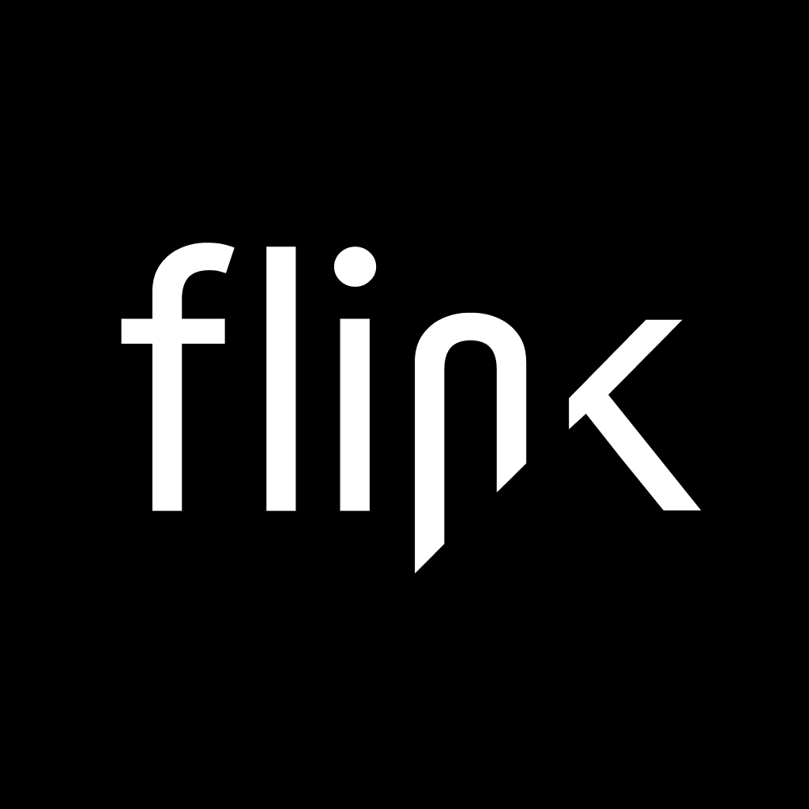

<h1 align="center">
  
</h1>

The FLINK.deeplink mobile SDKs provide a seamless solution for deferred deep linking in your iOS and Android applications. These SDKs bridge the gap between a user clicking a deep link and opening your app after installation, ensuring a smooth user journey from web to app or app to app.

> **Note:** FLINK.deeplink SDKs are desgined to work hand-in-hand with the FLINK.deeplink Routing Site. Access to the Routing Site is available upon request.

## 📖 Documentation

For full system architecture, SDK usage, and deployment instructions, visit the Wiki:

➡️ [FLINK.deeplink Enterprise – System Overview & SDKs](https://github.com/mohemian/flink-deeplink-sdks/wiki/FLINK.deeplink-Enterprise-%E2%80%93-System-Overview-&-SDKs)

## License

The FLINK.deeplink mobile SDKs are licensed under a proprietary license as specified in [LICENSE](LICENSE).
